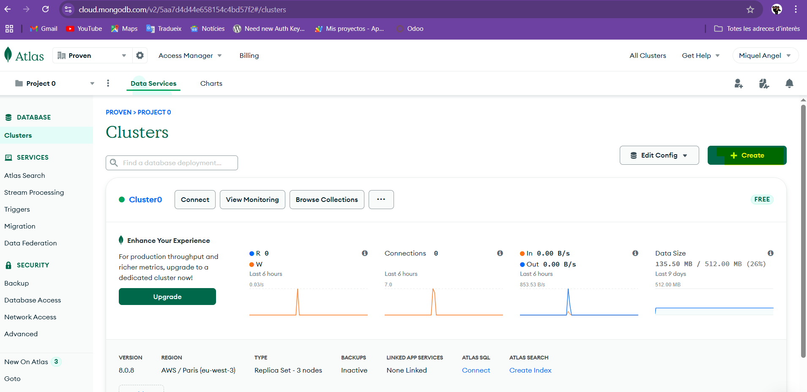
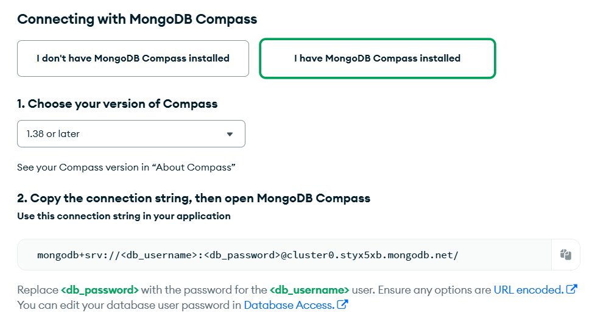
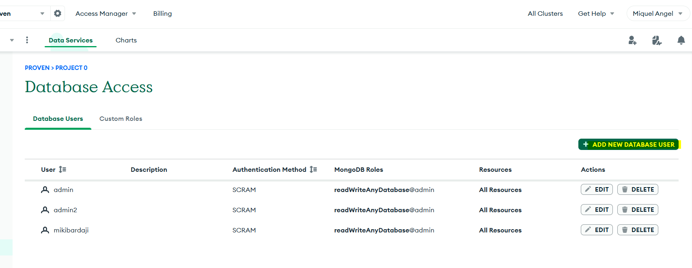
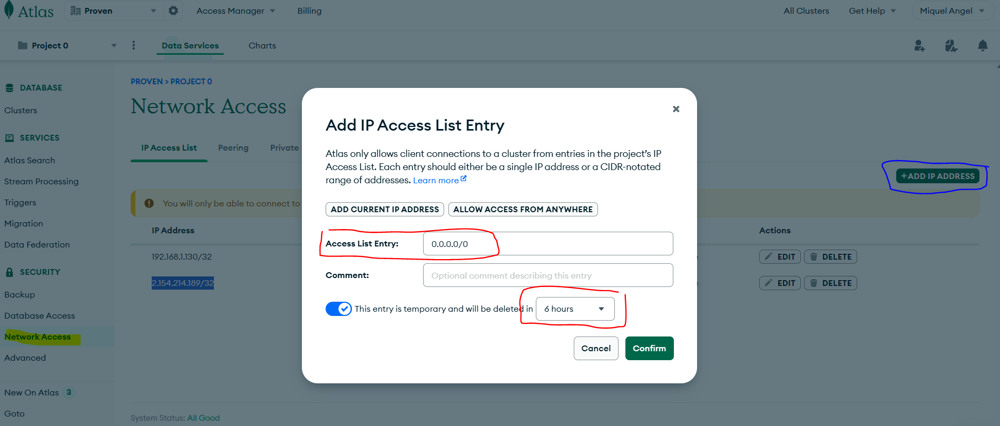

# CONECTAR TS AMB MONGODB

Crea un projecte amb Bun:

    mkdir monogdb
    cd monogdb
    bun init -y

Afegeix una dependència amb mongodb:

  > bun add mongodb

### Import client
Al iniciar tenim que afegir la llibreria que ens dona el client que atacarà al servidor

  > import {MongoClient} from "mongodb"

Un cop feta aquesta part, tenim que ficar la direcció del servidor, i obrir un pont/client

    const uri = "mongodb://localhost:27017" //per exemple
    const client = new MongoClient(uri) //creem el client que te la connexió

Bones pràctiques, no es olbigatori, pero si el script sempre te que atacar una colleccion al iniciar fixar-la

    const database = client.db('ocean')
    const fish = database.collection('fish')

Exemple pràctic d'un tipic exercici crud

    import { MongoClient } from "mongodb";

    // Connexió a MongoDB
    const uri = "mongodb://localhost:27017";  // Canvia l'URI si utilitzes un altre servidor MongoDB
    const client = new MongoClient(uri);

    try {
        await client.connect(); // Connexió amb la base de dades
        const db = client.db("botiga");  // Seleccionem la base de dades 'botiga'
        const productes = db.collection("productes");  // Seleccionem la col·lecció 'productes'

        // Crear (afegir un producte)
        const insertResult = await productes.insertOne({ nom: "Llapis", preu: 1.2 });
        if (insertResult.acknowledged) {
        console.log("Producte 'Llapis' afegit correctament!");
        } else {
        console.log("No s'ha pogut afegir el producte.");
        }

        // Llegir (consultar tots els productes)
        const tots = await productes.find().toArray();
        console.log("Tots els productes:", tots);

        // Actualitzar (modificar el preu del producte 'Llapis')
        const updateResult = await productes.updateOne(
        { nom: "Llapis" }, 
        { $set: { preu: 1.5 } }
        );
        if (updateResult.modifiedCount > 0) {
        console.log("Producte 'Llapis' actualitzat correctament!");
        } else {
        console.log("No s'ha trobat cap producte per actualitzar.");
        }

        // Eliminar (eliminar el producte 'Llapis')
        const deleteResult = await productes.deleteOne({ nom: "Llapis" });
        if (deleteResult.deletedCount > 0) {
        console.log("Producte 'Llapis' eliminat correctament!");
        } else {
        console.log("No s'ha trobat cap producte per eliminar.");
        }
    } catch (error) {
        console.error("Error amb MongoDB:", error);
    } finally {
        await client.close();  // Tanquem la connexió amb la base de dades
        console.log("Operacions CRUD completades!");
    }
  

A partir d'aquí les operacions que pots fer, son totes les possibles amb mongoDb, pel qual sol tens que tenir clar la teoria de [mongodb](https://www.w3schools.com/mongodb/index.php)

A partir d'aquí ens basarem amb l'ajuda que ja dona el mateix mongodb, amb typescript a la seva [pagina oficial](https://www.mongodb.com/docs/drivers/node/current/usage-examples/)

#### Creació cluster

A la web [atles mongodb](https://cloud.mongodb.com/), t'ofereix un cluster gratuït, per poder conectar-hi.

La url la pots obtenir a la pestanya *Connection* , que et dona el link vàlid per ficar al ts.

Per poder fer aquesta connexió, tindràs que crear un usuari amb permisos, per poder manipular la base de dades, o si sol es per consulta, dona-li els permisos pertinents:

I per poder realitzar les pertinents proves i perque no et doni problemes de conexió, habilita qualsevol connexió, temporalment, no es recomable deixar aquest accés, obert sempre

